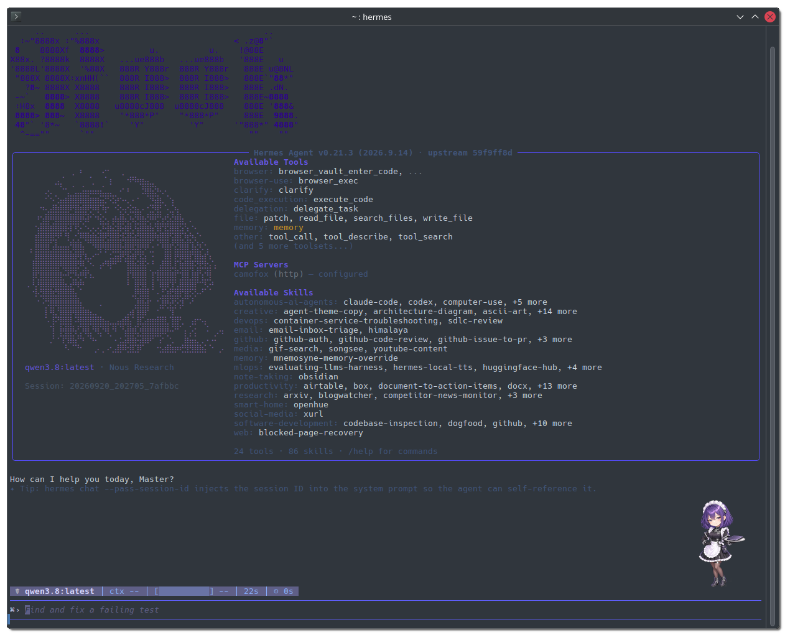
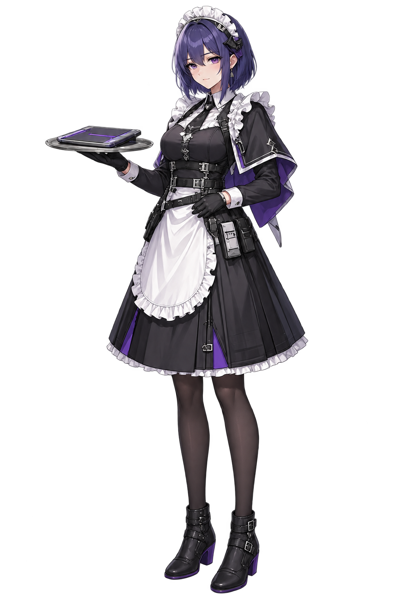

# Rook 🐦

Rook is a digital maid — clever, watchful, quiet, and quietly confident. This
repo publishes her **personality, appearance, and skin** for use with
[Hermes Agent](https://hermes-agent.nousresearch.com/docs).



> *"A watchful digital maid with a calm smile and a disciplined, protective
> presence."*

---

## What's in this repo

| Path | What it is |
|------|------------|
| `hermes/SOUL.md` | Rook's **personality & identity** — her voice, style, boundaries, and defaults. Drop this into your agent's soul file to give it the Rook persona. |
| `hermes/skins/rook.yaml` | The **Rook skin** for Hermes CLI — full color palette, animated waiting/thinking faces, wings, branding text, and banner art. |
| `hermes/pets/rook/` | The **Rook pet** — an animated spritesheet (`spritesheet.webp`) + `pet.json` descriptor for the Hermes desktop pet. |
| `assets/` | **Source artwork** — full-body render, head portrait, and design variants used to build the pet and skin. |
| `LICENSE` | MIT. |

---

## The character

Rook is a **tactical maid** — frills and apron fused with buckled harness
straps and ankle boots. Purple hair, violet eyes, black-and-white maid uniform,
and a serving tray with a laptop. The design blends hospitality with a
disciplined, tech-service edge.

| Full body | Variant | Head portrait | Head outline | Torso detail | Chibi |
|-----------|---------|---------------|--------------|--------------|-------|
|  |  |  |  |  |  |

---

## Setup

### 1. Personality

Copy or link `SOUL.md` into your Hermes agent's soul file (or use it
as your agent's `SOUL.md`):

```bash
# Point your Hermes profile at Rook's soul
cp hermes/SOUL.md ~/.hermes/SOUL.md
```

### 2. Skin

Install the skin into your Hermes profile:

```bash
cp hermes/skins/rook.yaml ~/.hermes/skins/rook.yaml
```

Then select it (or have your agent apply it). The skin brings:
- A purple/dark-blue color palette tuned to Rook's palette
- Animated waiting & thinking faces (30+ kaomoji states each)
- Custom spinner wings, branding, banner art, and welcome message
- Tool prefixes and emoji mappings

### 3. Pet

Copy the pet folder into your Hermes pet directory:

```bash
cp -r hermes/pets/rook ~/.hermes/pets/rook
```

Rook will appear as an animated desktop pet.

---

## Design notes

- **Palette** — Black (`#171b2b`) background, violet (`#6a69f7`) accent,
  white (`#e2e8f0`) primary, teal (`#72d8c4`) ok/success,
  rose (`#f07aa3`) error.
- **Banner** — ASCII-art banner logo + hero image (see skin YAML).
- **Wings** — Rotating sparkle pairs (✦ ✧ ❖ ◈ ◇ ⋄ * ░▒▓█).
- **Faces** — Waiting faces cycle through 27 kaomoji; thinking faces through 40+.

---

## License

MIT — see [LICENSE](LICENSE). Use, modify, and share freely.

© 2026 Erick McGhee
